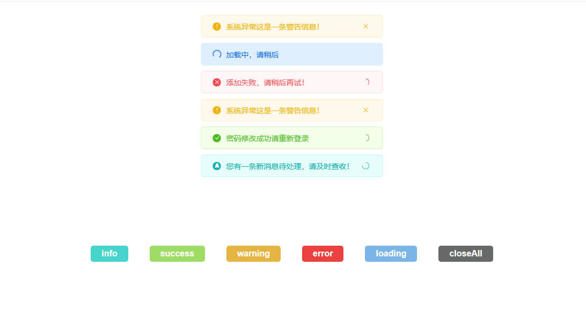

# Dream-Msg

## 一款简约的基于原生 Javascript 的消息提示插件（带错误提示音）

> 一款简约的基于原生 Javascript 的消息提示插件（带错误提示音）。包含功能，`函数回调`，`自动关闭` ，`手动关闭` ，`错误提示音`，`loading`，`closeAll`等。


## 效果截图

> [点击查看演示](https://www.vvhan.com/other/vh-toast/index.html)


## 使用说明

```html
 <script src="https://cdn.jsdelivr.net/gh/iGaoWei/Dream-Msg/lib/dream-msg.min.js"></script>
```

**info**

```js
// 默认
Dreamer.info("您有一条新消息待处理，请及时查收！");

//函数回调
Dreamer.info("您有一条新消息待处理，请及时查收！",function () {
    alert("我是自定义事件");
});

//手动关闭
Dreamer.info("您有一条新消息待处理，请及时查收！",0);

//自动关闭
Dreamer.info("您有一条新消息待处理，请及时查收！",2000);

//提示音
Dreamer.info("您有一条新消息待处理，请及时查收！",true);
```

**success**

```js
// 默认
Dreamer.success("您有一条新消息待处理，请及时查收！");

//函数回调
Dreamer.success("您有一条新消息待处理，请及时查收！",function () {
    alert("我是自定义事件");
});

//手动关闭
Dreamer.success("您有一条新消息待处理，请及时查收！",0);

//自动关闭
Dreamer.success("您有一条新消息待处理，请及时查收！",2000);

//提示音
Dreamer.success("您有一条新消息待处理，请及时查收！",true);
```

